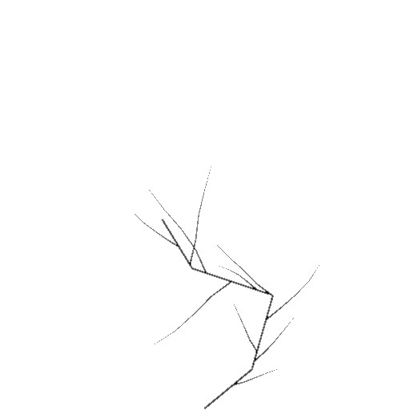
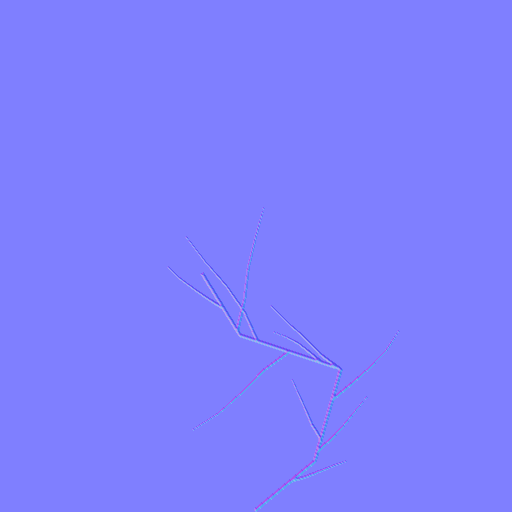

# PolyTexture

A stand-alone texture authoring tool for Godot 4 (C#). You draw regions and paths in physical units (centimeters),
stack generators and filters on top of them, and bake the result to Height, Mask and derived Normal PNG files.

It is a personal project, and it is developed in the open. It is not released, has no packaged build, and has no
stable file format beyond the current schema version.

<!-- TODO: Screenshot of the editor (workspace.png): canvas with the eggcrack example loaded, outliner on the left,
     Branch or Edge Falloff selected so the inspector and the scalar debug preview are visible. -->

## Motivation

Pixel-painted textures lose information: once a crack or a brick pattern is rasterized, its resolution, seed and
parameters are gone. This project explores the opposite approach: keep the authored structure (regions, paths, rules,
a seed) as the source of truth and treat every raster image as a rebuildable result. Changing the preview resolution,
the seed or one parameter re-evaluates the whole texture.

## What it can do today

- Author **Sources**: Rectangle Region, Ellipse Region, Crack Line (Bezier path with per-point width), generic
  center paths and guides.
- Derive structure with **Generators**: Sweep, Repeat Grid (staggered rows, clipped to the surface), Branch (recursive
  crack branching) and Scatter (clustered, seeded instances with scale and rotation variation).
- Transform with the **Operator** Mirror and change scalar fields with the **Filters** Invert and Edge Falloff. A
  selected filter shows a contrast-enhanced heatmap of its field as a debug preview.
- Bind results to **Outputs**: Height, named Masks. A Normal map is always derived from a Height output, never
  authored.
- Edit on a canvas with an outliner, inspector, multi-point selection, undo/redo, and Save/Load of JSON documents.
- Export each output as a grayscale PNG (Normal as RGB PNG).

Not implemented yet: Color output, decals or object-bound symbols, reusable Recipes, RGBA channel packing, the
Freeze/Make Editable operation, and any runtime import into a game. `docs/ARCHITECTURE.md` describes these as the
design direction, not as existing features.

## Workflow

1. Create or load a document (`Load JSON...`). The file dialog starts in `savefiles/`.
2. Add Sources (`Draw` / `Sources` menus), then Generators, Operators and Filters (`Generator`, `Operator`, `Filter`
   menus). Each element only references elements above it in the stack.
3. Create an Output (`+ Height`, `+ Mask`). With an element selected, only that element is bound. Without a selection,
   the whole visible graph is bound.
4. `Preview`, then `Export PNG...`. A Height output additionally offers `Preview Normal` and `Export Normal...`.

Example result from [`examples/eggcrack.polytexture.json`](examples/eggcrack.polytexture.json) (400 x 400 cm surface,
512 x 512 px): hand-drawn crack lines, recursive Branch generation, Invert, exported as Height and derived Normal.

| Height | Normal (derived from Height) |
| --- | --- |
|  |  |

<!-- TODO: GIF (about 10 s) of drawing a Crack Line, adding Branch, and watching the canvas update live. -->

Other setups covered by the automated tests: a brick wall (Rectangle Region, Repeat Grid with staggered rows, Invert
for mortar, separate Mask and Height outputs) and clustered scatter of Ellipse Regions.

## Document format

A document is one JSON file (`*.polytexture.json`, `schema_version: 1`). Unsupported schema versions are rejected, not
migrated. It stores only canonical data: textures with a physical `domain` in centimeters, an ordered list of
`elements`, and `outputs` that reference elements by stable ID. Evaluated geometry and bakes are not stored.

```json
{
  "schema_version": 1,
  "document_type": "polytexture",
  "textures": [
    {
      "id": "texture_101",
      "domain":  { "width_cm": 400, "height_cm": 400 },
      "preview": { "width_px": 512, "height_px": 512 },
      "elements": [
        { "id": "ellipse_region", "type": "ellipse_region",
          "position": { "x": 200, "y": 200 }, "width_cm": 240, "height_cm": 200 }
      ],
      "outputs": [
        { "id": "height", "name": "crack_height", "kind": "height",
          "source_element_ids": ["invert"], "height_amplitude_cm": 1 }
      ]
    }
  ]
}
```

The exchange format towards other projects is the exported PNG set. There is no runtime loader for the JSON documents.
Field meanings are documented in [`docs/DOCUMENT_MODEL.md`](docs/DOCUMENT_MODEL.md).

## Technical notes

- The whole project is C# (`net9.0`, `Godot.NET.Sdk 4.7.1`, Forward Plus renderer). There is no C++ or GDExtension
  code. It is a stand-alone Godot application (main scene `scenes/PolyTextureWorkspace.tscn`), not an editor plugin.
- Evaluation is a pure function of the document: it does not modify the document, and canvas, inspector and bake
  service all use the same evaluated result. The same document and seed give the same output.
- References use immutable IDs, so renaming does not break the graph. Validation rejects missing inputs, incompatible
  port types and cycles before evaluation.
- About 11,900 lines of C# in `scripts/` and `tests/`.

## Requirements and setup

- Godot 4.7 **.NET (Mono) build**, .NET SDK 9

```bash
git clone https://github.com/umut144/texture_workshop.git
cd texture_workshop
dotnet build
```

Then open `project.godot` in the Godot editor and run the project. Saved documents go to `savefiles/` and PNG exports
default to `output/`; both folders are git-ignored.

## Tests

A headless test runner with 28 tests covers serialization round trips, determinism of each generator, validation,
dependency-aware deletion, baking and the normal map derivation.

```bash
godot --headless --path . -s res://tests/PolyTextureTestRunner.cs
```

There is no CI. The runner exits with a non-zero code when a test fails.

## Project structure

- `scripts/`: document model, evaluator, validator, renderer, bake service and editor UI (C#)
- `scenes/`: the single workspace scene
- `tests/`: headless test runner
- `examples/`: a sample document
- `docs/`: architecture and document model notes, example images
- `savefiles/`, `output/`: local working folders (contents ignored by git)

## Status and next steps

The tools above work in manual testing, and the automated tests passed at the last documented checkpoint. The next
planned slice is object-bound symbols or decals and reusable Recipes. Material-bound texture libraries and
animation-ready reveal metadata for runtime shaders are planned after that. Numeric values such as Scatter clustering
have had little tuning on real content.

## Further reading

- [`docs/ARCHITECTURE.md`](docs/ARCHITECTURE.md): vocabulary, evaluation boundary, dependency rules
- [`docs/DOCUMENT_MODEL.md`](docs/DOCUMENT_MODEL.md): canonical model, identity, coordinates, outputs

## License

<!-- TODO: add a LICENSE file and name it here (MIT suggested). Not yet chosen. -->
No license has been chosen yet. Until one is added, all rights are reserved.
